# 📄 简介
深度视觉LabelmeAI是一款基于LabelMe开源版进行深度重开发的更加智能的标注工具。这个工具与开源版本相比的不同之处主要在于以下几点， 这些更改让你能够更加轻松的快速构建你的数据集。

# ✌️我们做了什么
## 1、深度视觉LabelmeAI自动保存json文件
Labelme**无法自动保存json文件**，需手动点击保存，文件大小通常 >100KB；\
深度视觉LabelmeAI可**自动化保存json文件**，**文件大小在5KB-15KB**；

**开源版labelme保存标注过程如下所示：**
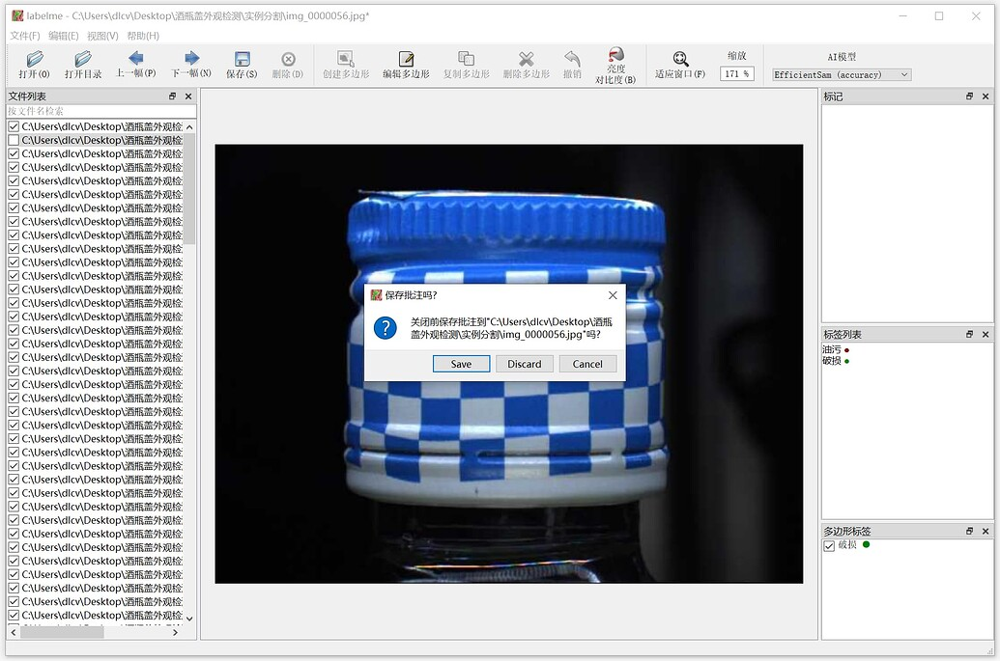
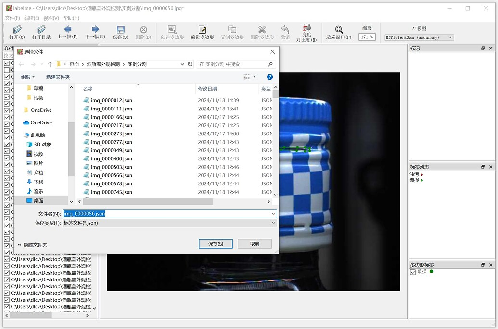
**生成的json文件对比：** \

## 2、深度视觉LabelmeAI 图片可显示标签名称、RGB
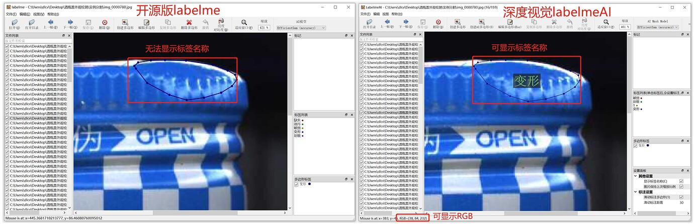
## 3、深度视觉LabelmeAI加载、切换>4k大图速度较快
**深度视觉LabelmeAI切换图像，速度快、不卡顿**

**开源版Labelme切换图像，速度较慢、卡顿明显**
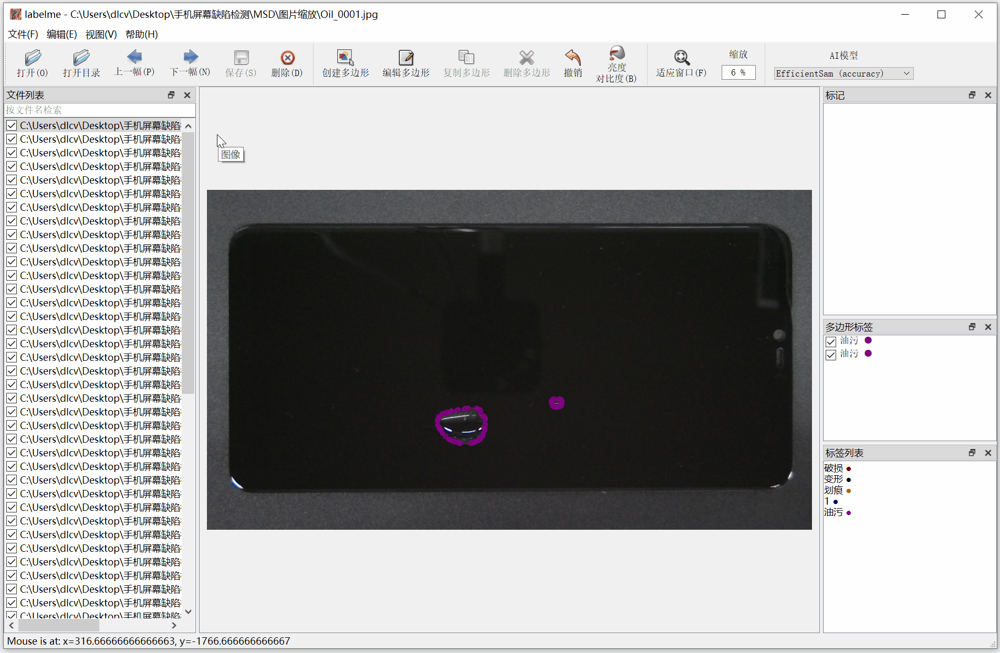
## 4、深度视觉LabelmeAI增加画笔功能
深度视觉LabelmeAI**增加画笔功能**，还可**调节滑动标注距离**。开源版labelme无此画笔功能，需要一直点击鼠标左键创建多边形点完成标注。\
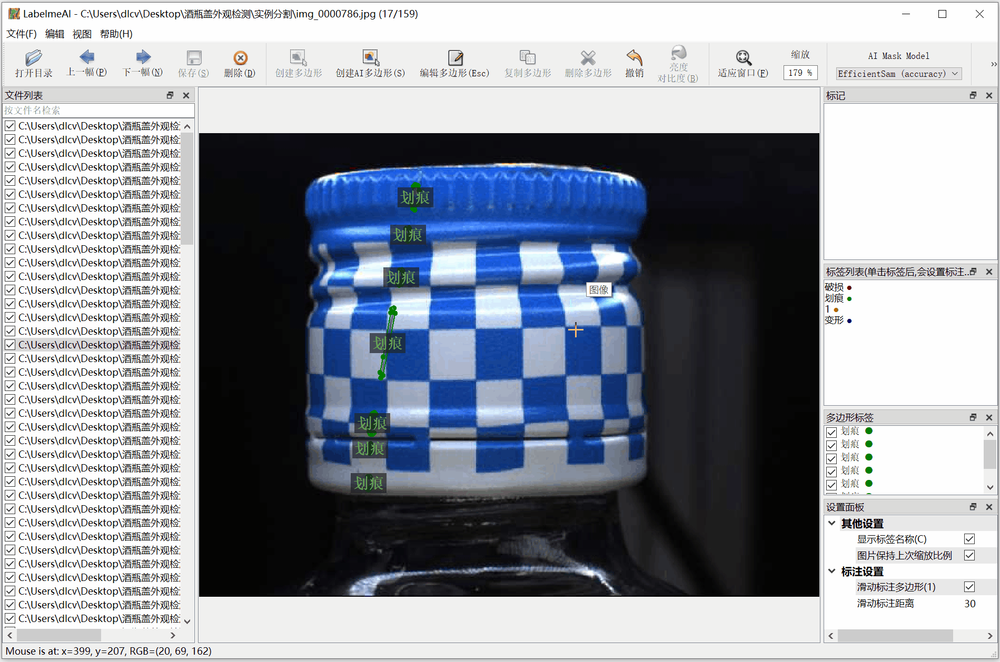
## 5、深度视觉LabelmeAI更简易修改标签
深度视觉LabelmeAI,**双击标签，可修改标签名称**。
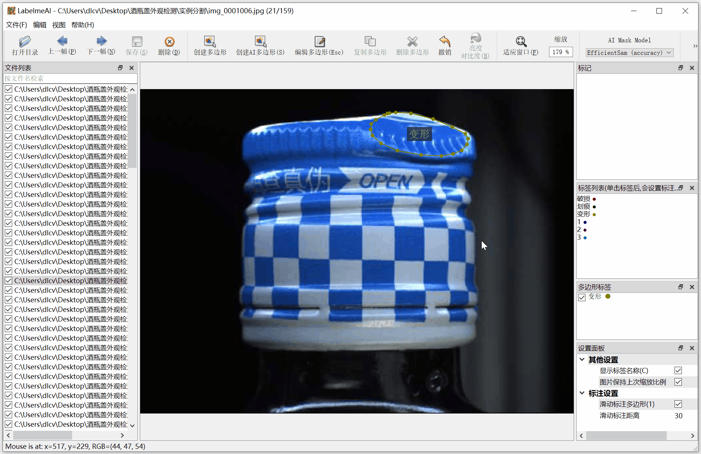
开源版labelme只能选中标签后，在多边形标签栏进行修改。
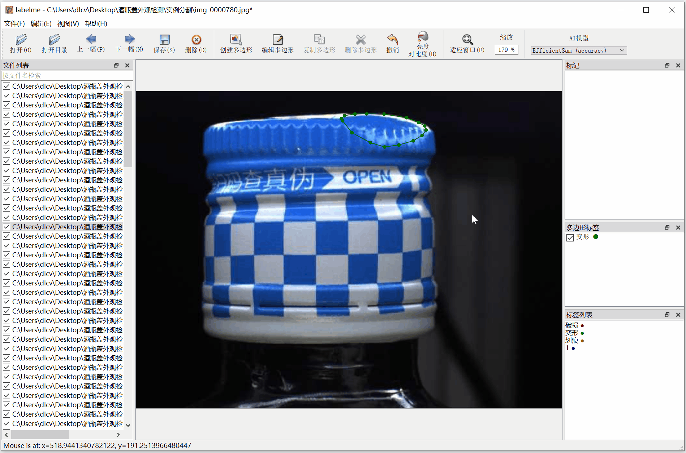
## 6、深度视觉LabelmeAI图片像素级显示
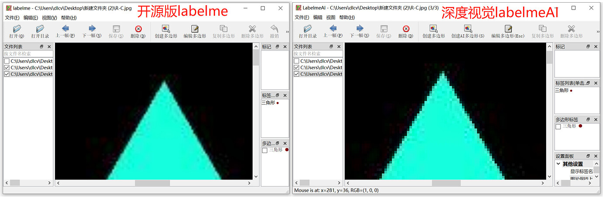
## 7、深度视觉LabelmeAI可右键打开文件夹
深度视觉LabelmeAI可**右键打开文件夹**，更便捷的打开文件方式。
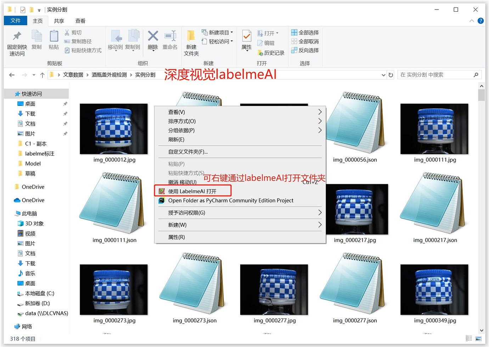
开源版Labelme只能通过**打开labelme>打开目录>输入文件路径>选择文件夹，才可以打开文件**。\
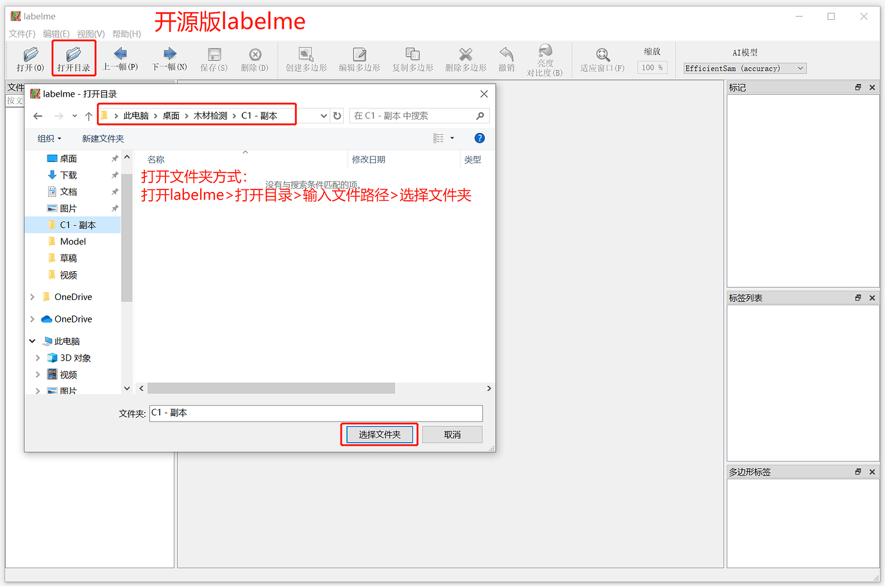
## 8、深度视觉labelmeAI增加许多创建标注快捷键
深度视觉labelmeAI新增创建圆形、直线、控制点、AI多边形快捷键,开源版labelme无这些快捷键。
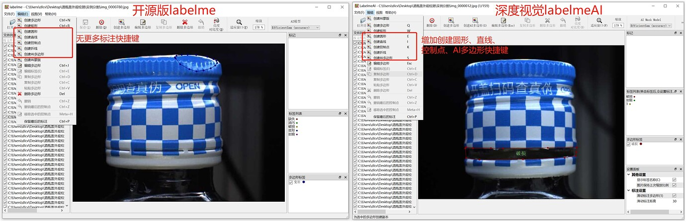
## 9、深度视觉labelmeAI支持将原图转换成灰度图
深度视觉labelmeAI支持将原图转换成灰度图，灰度图消除了颜色的干扰，使得图像的形状和纹理更明显，同时还降低标注人员的眼睛疲劳感。开源版labelme不支持转换。\
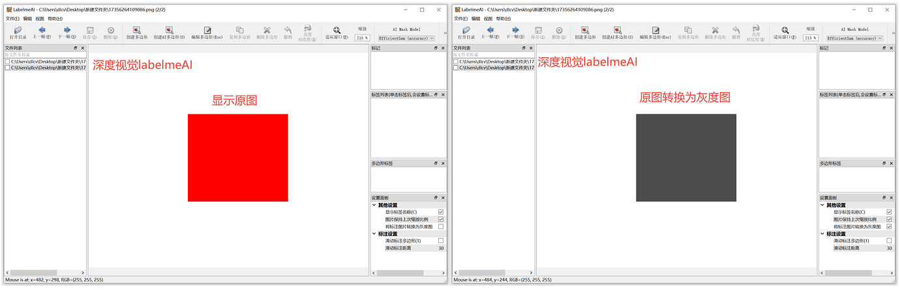

# 🔗 更多详细操作详见
https://bbs.dlcv.com.cn/t/topic/160
# 🙇‍ Acknowledgement
This repo is the fork of [labelme](https://github.com/wkentaro/labelme)
