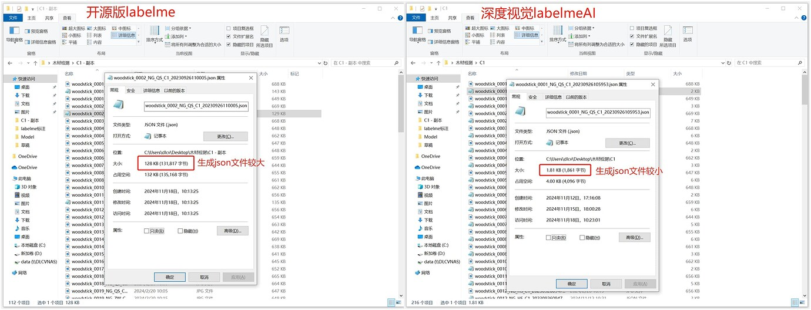

# 📄 简介
深度视觉LabelmeAI是一款基于LabelMe开源版进行深度重开发的更加智能的标注工具。 如名所示，这个工具与开源版本相比主要在于以下几点， 这些更改让你能够快速构建你的数据集。

# 📚 目录
<li><a href="#快速启动">快速启动</a></li>
<li><a href="#我们做了什么">修改说明</a></li>
<li><a href="https://bbs.dlcv.com.cn/t/topic/160">详细使用手册</a></li>
<li><a href="#faq">常见问题</a></li>
<li><a href="#acknowledgement">鸣谢</a></li>


# 🛫 快速启动

## 1. 环境准备
- 推荐使用 Python 3.8 及以上版本（建议3.10/3.11，需提前安装好Python环境）。
- 支持 Windows 10/11，理论兼容 Linux（如需在Linux下运行，需自行解决PyQt等依赖的安装）。
- 建议使用虚拟环境（如`venv`或`conda`）隔离依赖。

## 2. 安装依赖
在项目根目录下执行：

```bash
pip install -r requirements-dev.txt
```

如需打包或完整体验AI功能，需额外安装：
```bash
pip install pyqt-toast-notification open3d
```

## 3. 启动软件
- 图形界面启动（推荐）：

  ```bash
  python -m labelme
  ```
  或
  ```bash
  python labelme/__main__.py
  ```

  - 可通过命令行参数指定图片或标注文件夹：
    ```bash
    python -m labelme 路径/到/图片或文件夹
    ```

- 常用命令行参数说明：
  - `--labels labels.txt` 指定标签文件
  - `--nodata` 不在json中保存图片数据
  - `--autosave` 自动保存
  - `--output` 指定输出目录或文件
  - 更多参数可通过 `python -m labelme --help` 查看

## 4. 标注数据集示例

- 以目标检测为例，进入示例目录：

  ```bash
  cd examples/bbox_detection
  # 标注图片
  python -m labelme data_annotated --labels labels.txt --nodata --autosave
  # 转换为VOC格式数据集
  python labelme2voc.py data_annotated data_dataset_voc --labels labels.txt
  ```

- 以实例分割为例：

  ```bash
  cd examples/instance_segmentation
  python -m labelme data_annotated --labels labels.txt --nodata --autosave
  python labelme2voc.py data_annotated data_dataset_voc --labels labels.txt
  python labelme2coco.py data_annotated data_dataset_coco --labels labels.txt
  ```

- 以语义分割为例：

  ```bash
  cd examples/semantic_segmentation
  python -m labelme data_annotated --labels labels.txt --nodata --autosave
  python labelme2voc.py data_annotated data_dataset_voc --labels labels.txt --noobject
  ```

## 5. 常见问题（FAQ）
- 若遇到PyQt相关依赖问题，请确保已正确安装`PyQt5`或`PySide2`。
- 部分AI功能需NVIDIA显卡及较新驱动（推荐531及以上），否则仅支持CPU推理。
- 右键可直接在文件夹上打开，支持大图、快捷键、画笔、灰度图等增强功能。
- 更多详细教程与常见问题请见：[详细使用手册](https://bbs.dlcv.com.cn/t/topic/160)


# ✌️ 我们做了什么
**1、深度视觉LabelmeAI自动保存json文件** \
Labelme**无法自动保存json文件**，需手动点击保存，文件大小通常 >100KB；\
深度视觉LabelmeAI可**自动化保存json文件**，**文件大小在5KB-15KB**

**开源版labelme保存标注过程如下所示：**


**生成的json文件对比：** \


**2、深度视觉LabelmeAI 图片可显示标签名称、RGB**

**3、深度视觉LabelmeAI加载、切换>4k大图速度较快
深度视觉LabelmeAI切换图像，速度快、不卡顿**

**开源版Labelme切换图像，速度较慢、卡顿明显：**

**4、深度视觉LabelmeAI增加画笔功能** \
深度视觉LabelmeAI**增加画笔功能**，还可**调节滑动标注距离**。开源版labelme无此画笔功能，需要一直点击鼠标左键创建多边形点完成标注。\

**5、深度视觉LabelmeAI更简易修改标签**\
深度视觉LabelmeAI,**双击标签，可修改标签名称**。

开源版labelme只能选中标签后，在多边形标签栏进行修改。

**6、深度视觉LabelmeAI图片像素级显示**

**7、深度视觉LabelmeAI可右键打开文件夹**\
深度视觉LabelmeAI可**右键打开文件夹**，更便捷的打开文件方式。

开源版Labelme只能通过**打开labelme>打开目录>输入文件路径>选择文件夹，才可以打开文件**。\

**8、深度视觉labelmeAI增加许多创建标注快捷键**\
深度视觉labelmeAI新增创建圆形、直线、控制点、AI多边形快捷键,开源版labelme无这些快捷键。

**9、深度视觉labelmeAI支持将原图转换成灰度图**\
深度视觉labelmeAI支持将原图转换成灰度图，灰度图消除了颜色的干扰，使得图像的形状和纹理更明显，同时还降低标注人员的眼睛疲劳感。开源版labelme不支持转换。\


# 🔗 更多详细操作详见
https://bbs.dlcv.com.cn/t/topic/160

# FAQ
- 若遇到依赖安装、环境配置、AI功能等问题，建议优先查阅[详细使用手册](https://bbs.dlcv.com.cn/t/topic/160)或在社区发帖提问。

# Acknowledgement
This repo is the fork of [labelme](https://github.com/wkentaro/labelme)